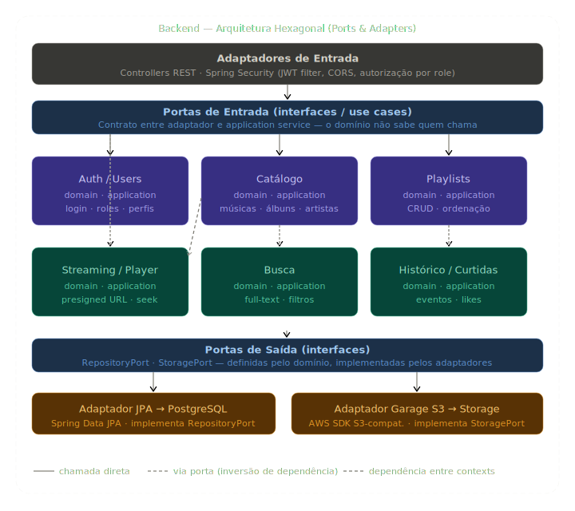

# Projeto Arquitetural do Software

Documento construído a partido do **Modelo BSI - Doc 005 - Documento de Projeto Arquitetual do Software** que pode ser encontrado no
link:https://docs.google.com/document/d/1i80vPaInPi5lSpI7rk4QExnO86iEmrsHBfmYRy6RDSM/edit?usp=sharing

# 01 - Visão Geral do Sistema

O sistema é uma plataforma de streaming de música inspirada no Spotify, desenvolvida como projeto acadêmico na disciplina de Engenharia de Software. O objetivo é permitir que ouvintes descubram e consumam músicas, artistas façam upload de seu conteúdo, e administradores gerenciem a plataforma.

## Decisões arquiteturais centrais

- **Backend com arquitetura hexagonal** em Java 25 + Spring Boot — núcleo de domínio isolado de frameworks e infraestrutura, com comunicação ao mundo externo exclusivamente por portas e adaptadores.
- **Frontend em Next.js com arquitetura hexagonal** — separação clara entre domínio de aplicação, portas de comunicação e adaptadores de UI/infraestrutura.
- **Separação clara entre** dados relacionais (PostgreSQL), objetos binários (Garage) e sessão/cache.


## Perfis de usuário

| Perfil | Responsabilidades |
|---|---|
| Ouvinte | Consome músicas, cria playlists, curte e acessa histórico |
| Artista | Faz upload de músicas e álbuns, gerencia seu catálogo |
| Administrador | Gerencia usuários, conteúdo e configurações da plataforma |

## Módulos de domínio

- **Auth / Users** - autenticação, autorização e perfis
- **Músicas / Álbuns / Artistas** - catálogo e metadados
- **Playlists** - criação e gerenciamento
- **Streaming / Player** - entrega de áudio via presigned URL
- **Busca** - pesquisa full-text por músicas, artistas e álbuns
- **Histórico / Curtidas** - registro de eventos de reprodução e likes

# 02 - Visão de Contexto (C4 - Nível 1)

Mostra os atores externos e como eles interagem com o sistema como um todo, sem entrar em detalhes internos.

## Diagrama


## Atores externos

| Ator | Tipo | Interação |
|---|---|---|
| Ouvinte | Pessoa | Navega pelo catálogo, ouve músicas, gerencia playlists e curtidas |
| Artista | Pessoa | Faz upload de músicas e álbuns, gerencia seu conteúdo |
| Administrador | Pessoa | Gerencia usuários, conteúdo e configurações da plataforma |

## Sistemas externos

| Sistema | Tipo | Papel |
|---|---|---|
| Garage | Armazenamento de objetos (S3-compatible) | Armazena arquivos de áudio, capas de álbuns e avatares |
| PostgreSQL 15 | Banco de dados relacional | Armazena todos os dados estruturados da aplicação |

## Observações

- O frontend (Next.js) é parte interna do sistema e não aparece como ator externo neste nível.
- O Garage é acessado tanto pelo backend (para gerar presigned URLs) quanto diretamente pelo navegador (para streaming de áudio), mas essa distinção só aparece no nível de containers.

# 03 - Visão de Containers (C4 - Nível 2)

Mostra como o sistema se divide em unidades deployáveis e como elas se comunicam entre si.

## Diagrama


## Containers

| Container | Tecnologia | Responsabilidade |
|---|---|---|
| Next.js App | Next.js + TypeScript | Interface de usuário; SSR para páginas públicas, CSR para player e dashboards |
| Backend (Spring Boot) | Java 25 + Spring Boot | Lógica de negócio, autenticação, geração de presigned URLs, persistência |
| PostgreSQL 15 | PostgreSQL | Armazenamento relacional de todos os dados estruturados |
| Garage | Garage (S3-compatible) | Armazenamento de objetos binários (áudio, imagens) |

## Comunicações

| De | Para | Protocolo | Descrição |
|---|---|---|---|
| Next.js | Spring Boot | HTTPS / REST + JSON | Todas as operações de dados e autenticação |
| Spring Boot | PostgreSQL | JDBC (Spring Data JPA) | Leitura e escrita de dados relacionais |
| Spring Boot | Garage | S3 API (SDK) | Geração de presigned URLs; upload no fluxo do artista |
| Next.js | Garage | HTTPS (presigned URL) | Streaming de áudio direto - sem passar pelo backend |

## Decisão: presigned URLs para streaming

O áudio **nunca trafega pelo servidor Java**. O backend apenas gera uma URL temporária assinada (expira em ~60s) que o navegador usa para requisitar o arquivo diretamente ao Garage via HTTP Range Requests. Isso atende ao **RNF04** (início de reprodução rápido) e evita que o backend se torne gargalo de I/O.

# 04 - Arquitetura do Backend - Monolito Modular

## Visão geral

O backend adota a **arquitetura hexagonal (Ports & Adapters)**. O núcleo da aplicação — domínio e casos de uso — é completamente isolado de frameworks, banco de dados e qualquer detalhe de infraestrutura. Todo acesso ao mundo externo passa por interfaces (portas) que o domínio define; os adaptadores implementam essas interfaces sem que o domínio saiba de sua existência. A dependência sempre flui de fora para dentro.

## Diagrama de módulos



## Estrutura interna de cada módulo
 
```
modulo/
├── domain/               ← núcleo isolado (entidades, value objects, regras de negócio)
├── application/
│    ├── ports/
│    │    ├── in/         ← portas de entrada (casos de uso — interfaces)
│    │    └── out/        ← portas de saída (repositórios, serviços externos — interfaces)
│    └── services/        ← implementação dos casos de uso (orquestra domínio + portas out)
└── adapters/
     ├── in/
     │    └── web/        ← controllers REST (@RestController) — adaptador de entrada
     └── out/
          ├── jpa/        ← repositórios Spring Data JPA — adaptador de saída
          └── storage/    ← cliente Garage S3 — adaptador de saída
```
 
## Bounded contexts
 
### Auth / Users
Responsável pela autenticação e gerenciamento de identidades.
 
- Registro, login e logout
- Geração e validação de tokens JWT
- Gerenciamento de roles (`OUVINTE`, `ARTISTA`, `ADMIN`)
- Atualização de perfil e avatar
### Catálogo (Músicas / Álbuns / Artistas)
Coração do sistema - gerencia todo o conteúdo musical.
 
- CRUD de músicas, álbuns e artistas
- Upload de áudio e capas via Garage
- Metadados (duração, gênero, ano, etc.)
- Expõe porta de entrada `CatalogUseCase` como contrato público do módulo
### Playlists
Gerenciamento das coleções de músicas dos usuários.
 
- CRUD de playlists
- Adição, remoção e reordenação de faixas
- Playlists públicas e privadas
### Streaming / Player
Entrega segura e rápida do áudio.
 
- Valida se a música existe (via porta de saída para o módulo de Catálogo)
- Valida JWT do usuário
- Gera presigned URL temporária no Garage
- Suporte a HTTP Range Requests para seeking
### Busca
Permite aos usuários encontrar conteúdo na plataforma.
 
- Full-text search via `pg_trgm` (PostgreSQL)
- Filtros por tipo (música, artista, álbum)
- Ordenação por relevância
### Histórico / Curtidas
Registra o comportamento do usuário para personalização.
 
- Registro assíncrono de eventos de reprodução
- Gerenciamento de músicas curtidas
- Histórico de reprodução paginado
## Regra de dependência
 
```
Adaptadores  →  Portas  →  Domínio
  (web, jpa)    (in/out)   (puro)
```
 
Nenhuma classe do pacote `domain` importa qualquer classe de `adapters` ou de frameworks externos. A inversão de dependência é garantida pelas interfaces declaradas em `application/ports/out`.
 
## Fluxo de reprodução de música
 
```
Usuário clica play
       │
       ▼
GET /stream/{trackId}  [com JWT no header]
       │
       ▼
Adaptador Web (StreamingController) recebe requisição
       │
       ▼
Porta de entrada: StreamingUseCase.gerarUrlReproducao(trackId, userId)
       │
       ▼
Service valida usuário e consulta porta de saída: CatalogRepository.findTrack(trackId)
       │
       ▼
Porta de saída: StoragePort.gerarPresignedUrl(objectKey, 60s)
       │
       ▼
Adaptador de saída (GarageStorageAdapter) chama API S3 do Garage
       │
       ▼
Retorna URL temporária ao frontend
       │
       ▼
Frontend acessa Garage diretamente via HTTP Range Requests
       │
       ▼  (assíncrono, não bloqueia a reprodução)
POST /history  →  registra evento de play
```

# 05 - Arquitetura do Frontend - Next.js

## Visão geral

O frontend adota o **App Router do Next.js** com organização por feature e princípios da arquitetura hexagonal. O domínio de aplicação (regras de UI, modelos, casos de uso do cliente) fica isolado dos adaptadores de infraestrutura (chamadas HTTP, armazenamento local) e dos adaptadores de UI (componentes React). A dependência flui sempre de fora para dentro.

## Estrutura de pastas
 
```
src/
├── app/
│    ├── (rotas Next.js)
│    └── api/               ← adaptadores de entrada (BFF / route handlers)
│
├── features/
│    └── [feature]/
│         ├── domain/        ← modelos e regras de negócio do cliente
│         ├── application/
│         │    ├── ports/    ← interfaces de casos de uso e repositórios
│         │    └── services/ ← implementação dos casos de uso
│         ├── adapters/
│         │    ├── in/       ← hooks, páginas (adaptadores de entrada)
│         │    └── out/      ← services HTTP, storage (adaptadores de saída)
│         └── components/    ← componentes React da feature
│
└── shared/
     ├── components/         ← componentes reutilizáveis
     ├── hooks/
     ├── models/
     └── utils/
```

## Estratégia de renderização por página

| Página | Estratégia | Justificativa |
|---|---|---|
| Home / Descoberta | SSR | Dados frescos + bom para performance percebida |
| Página de artista / álbum | SSR | SEO relevante para conteúdo público |
| Busca | CSR (SWR / React Query) | Input reativo em tempo real, sem necessidade de SEO |
| Player (barra inferior) | Client Component | Estado local + Web Audio API |
| Dashboard do artista | CSR | Dados privados, sem necessidade de SEO |
| Painel administrativo | CSR | Dados privados, sem necessidade de SEO |


## Estado global

O **player de música** requer estado global persistente entre navegações (música tocando, fila, volume). A recomendação é usar **Zustand** para este estado, pois:

- API simples e sem boilerplate excessivo
- Compatível com o modelo de Client Components do Next.js App Router
- Fácil integração com a Web Audio API / elemento `<audio>`

Os demais estados são locais por componente ou gerenciados via cache de servidor (SWR / React Query).

## Gerenciamento de dados

| Tipo de dado | Solução | Motivo |
|---|---|---|
| Dados de servidor (listas, perfis) | SWR ou React Query | Cache, revalidação, deduplicação automática |
| Estado do player | Zustand | Persistência entre rotas sem re-render global |
| Formulários | React Hook Form | Validação performática sem re-renders |
| Auth / sessão | Cookie HttpOnly + middleware Next.js | Segurança (RNF02/RNF03) |

## Autenticação no frontend

O token JWT é armazenado em **cookie HttpOnly** (não acessível via JavaScript), configurado pelo backend no login. O middleware do Next.js verifica a presença do cookie para proteger rotas antes de renderizar a página, redirecionando para `/login` se necessário.

```
Requisição para /library
        │
        ▼
middleware.ts verifica cookie de sessão
        │
   ┌────┴────┐
   │         │
válido    inválido
   │         │
   ▼         ▼
renderiza  redirect /login
  página
```

## Fluxo de upload (artista)

```
Artista seleciona arquivo de áudio
        │
        ▼
Frontend solicita presigned URL de upload
POST /upload/presigned  →  Backend  →  Garage
        │
        ▼
Backend retorna URL temporária de upload
        │
        ▼
Frontend faz PUT direto no Garage (sem passar pelo backend)
        │
        ▼
Frontend notifica backend que upload concluiu
POST /tracks  →  Backend persiste metadados no PostgreSQL
```

# 06 - Decisões Arquiteturais (ADRs)

Registro das principais decisões de arquitetura, suas motivações e as alternativas consideradas.

---

## ADR-01 - Monolito Modular no Backend

**Status:** Aceito
 
**Contexto:** O projeto precisa de separação clara entre regras de negócio e detalhes de infraestrutura (banco, storage, HTTP) para facilitar manutenção, testes e eventual migração de tecnologias.
 
**Decisão:** Adotar a arquitetura hexagonal (Ports & Adapters) em ambas as camadas. O domínio de cada módulo não conhece frameworks nem infraestrutura. A comunicação se dá exclusivamente por interfaces (portas).
 
**Motivação:**
- Domínio testável isoladamente, sem necessidade de banco ou servidor
- Troca de adaptadores (ex: banco, storage) sem alterar regras de negócio
- Inversão de dependência garantida estruturalmente
- Atende ao RNF12 (manutenibilidade modular)
**Alternativas consideradas:**
- Arquitetura em camadas tradicional (controller → service → repository) — acoplamento maior entre negócio e infraestrutura
- Clean Architecture estrita — overhead de camadas desnecessário para o escopo acadêmico

---

## ADR-02 - Autenticação com JWT Stateless

**Status:** Aceito

**Contexto:** O sistema precisa autenticar três perfis de usuário com diferentes permissões (RNF01, RNF03).

**Decisão:** Usar JWT (JSON Web Tokens) com Spring Security. Tokens armazenados em cookies HttpOnly no cliente.

**Motivação:**
- Stateless - sem necessidade de sessão no servidor, facilita escalabilidade
- Suporte nativo no Spring Security
- Cookie HttpOnly protege contra XSS (RNF02)
- Claims de role embutidos no token permitem autorização sem consulta ao banco

**Alternativas consideradas:**
- Sessions no servidor - requer estado compartilhado, dificulta escalabilidade
- OAuth2 externo - complexidade desnecessária para o escopo

---

## ADR-03 - Streaming de Áudio via Presigned URLs

**Status:** Aceito

**Contexto:** O áudio é o recurso central da plataforma. A entrega precisa ser rápida e não pode se tornar gargalo (RNF04).

**Decisão:** O backend gera presigned URLs temporárias (expiram em 60s). O navegador acessa o Garage diretamente para streaming.

**Motivação:**
- Áudio não passa pelo servidor Java - elimina gargalo de I/O
- HTTP Range Requests nativos no Garage permitem seeking sem workarounds
- Backend fica livre para processar outras requisições
- URL temporária garante que apenas usuários autenticados acessem o conteúdo

**Alternativas consideradas:**
- Proxy de áudio no backend - simples, mas inviável para performance em escala
- CDN externo - custo e complexidade desnecessários no contexto acadêmico

---

## ADR-04 - Next.js App Router com Renderização Híbrida

**Status:** Aceito

**Contexto:** O frontend precisa de boa performance percebida, páginas públicas com SEO e partes altamente interativas (player).

**Decisão:** Usar Next.js App Router com Server Components para páginas públicas e Client Components para interações.

**Motivação:**
- SSR nas páginas de artista e álbum melhora performance e SEO
- Client Components isolam o estado interativo sem penalizar o resto
- App Router é a arquitetura recomendada e de longo prazo do Next.js

**Alternativas consideradas:**
- SPA pura (Vite + React) - sem SSR, pior performance percebida
- Next.js Pages Router - legado, sem Server Components

---

## ADR-05 - PostgreSQL como Banco de Dados Principal

**Status:** Aceito

**Contexto:** O sistema armazena dados relacionais complexos com integridade referencial entre usuários, músicas, playlists e histórico (RNF13).

**Decisão:** PostgreSQL 15 com Spring Data JPA.

**Motivação:**
- ACID garante integridade dos dados
- Suporte nativo a full-text search via `pg_trgm` (módulo de Busca)
- Amplamente suportado e bem documentado
- Compatível com a stack Java/Spring

**Alternativas consideradas:**
- MySQL - sem `pg_trgm`, full-text search mais limitado
- MongoDB - modelo de documentos inadequado para dados altamente relacionais

---

## ADR-06 - Garage para Storage de Objetos

**Status:** Aceito

**Contexto:** O sistema precisa armazenar arquivos binários (áudio, capas, avatares) de forma escalável e independente do banco de dados relacional (RNF15).

**Decisão:** Garage auto-hospedado com API compatível com S3.

**Motivação:**
- API S3-compatible permite migração futura para AWS S3 sem mudança de código
- Auto-hospedado - ideal para ambiente de desenvolvimento e testes acadêmicos
- Suporte nativo a presigned URLs e HTTP Range Requests
- Gratuito e de código aberto

**Alternativas consideradas:**
- AWS S3 - custo e complexidade de configuração desnecessários no contexto
- Armazenar arquivos no sistema de arquivos local - sem escalabilidade, dificulta deploy

---

## ADR-07 - Separação Frontend/Backend por REST API

**Status:** Aceito

**Contexto:** Frontend e backend precisam evoluir de forma independente (RNF11).

**Decisão:** Frontend consome o backend exclusivamente via REST API com JSON. Nenhuma lógica de servidor é compartilhada entre as camadas além do contrato de API.

**Motivação:**
- Desacoplamento total permite que cada parte evolua sem impactar a outra
- Facilita testes independentes de cada camada
- Contrato de API explícito (documentado via Swagger/OpenAPI) serve como limite claro

