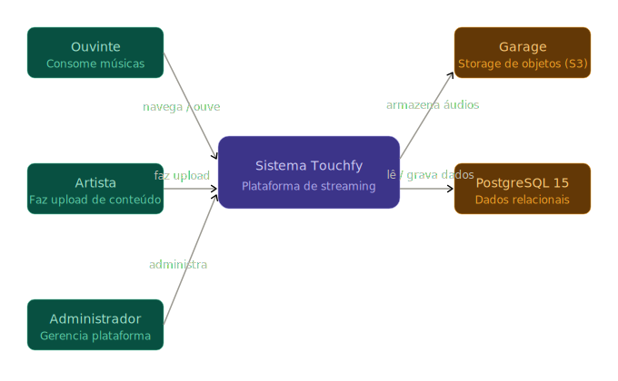
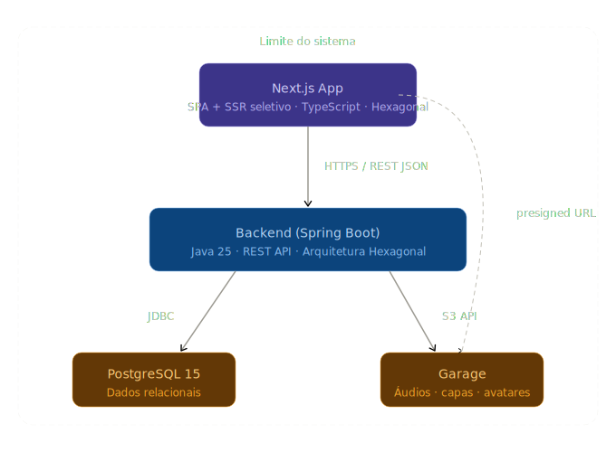

# Projeto Arquitetural do Software

Documento construído a partido do **Modelo BSI - Doc 005 - Documento de Projeto Arquitetual do Software** que pode ser encontrado no
link:https://docs.google.com/document/d/1i80vPaInPi5lSpI7rk4QExnO86iEmrsHBfmYRy6RDSM/edit?usp=sharing

# 01 - Visão Geral do Sistema

O sistema é uma plataforma de streaming de música inspirada no Spotify, desenvolvida como projeto acadêmico na disciplina de Engenharia de Software. O objetivo é permitir que ouvintes descubram e consumam músicas, artistas façam upload de seu conteúdo, e administradores gerenciem a plataforma.

## Decisões arquiteturais centrais

- **Backend como monolito modular** em Java 25 + Spring Boot - simplicidade operacional com fronteiras de domínio bem definidas por pacotes Java.
- **Frontend como SPA com SSR seletivo** em Next.js - melhor experiência de usuário e SEO via App Router.
- **Separação clara entre** dados relacionais (PostgreSQL), objetos binários (MinIO) e sessão/cache.

## Perfis de usuário

| Perfil | Responsabilidades |
|---|---|
| Ouvinte | Consome músicas, cria playlists, curte e acessa histórico |
| Artista | Faz upload de músicas e álbuns, gerencia seu catálogo |
| Administrador | Gerencia usuários, conteúdo e configurações da plataforma |

## Módulos de domínio

- **Auth / Users** - autenticação, autorização e perfis
- **Músicas / Álbuns / Artistas** - catálogo e metadados
- **Playlists** - criação e gerenciamento
- **Streaming / Player** - entrega de áudio via presigned URL
- **Busca** - pesquisa full-text por músicas, artistas e álbuns
- **Histórico / Curtidas** - registro de eventos de reprodução e likes

# 02 — Visão de Contexto (C4 — Nível 1)

Mostra os atores externos e como eles interagem com o sistema como um todo, sem entrar em detalhes internos.

## Diagrama



## Atores externos

| Ator | Tipo | Interação |
|---|---|---|
| Ouvinte | Pessoa | Navega pelo catálogo, ouve músicas, gerencia playlists e curtidas |
| Artista | Pessoa | Faz upload de músicas e álbuns, gerencia seu conteúdo |
| Administrador | Pessoa | Gerencia usuários, conteúdo e configurações da plataforma |

## Sistemas externos

| Sistema | Tipo | Papel |
|---|---|---|
| MinIO | Armazenamento de objetos | Armazena arquivos de áudio, capas de álbuns e avatares |
| PostgreSQL 15 | Banco de dados relacional | Armazena todos os dados estruturados da aplicação |

## Observações

- O frontend (Next.js) é parte interna do sistema e não aparece como ator externo neste nível.
- O MinIO é acessado tanto pelo backend (para gerar presigned URLs) quanto diretamente pelo navegador (para streaming de áudio), mas essa distinção só aparece no nível de containers.

# 03 — Visão de Containers (C4 — Nível 2)

Mostra como o sistema se divide em unidades deployáveis e como elas se comunicam entre si.

## Diagrama



## Containers

| Container | Tecnologia | Responsabilidade |
|---|---|---|
| Next.js App | Next.js + TypeScript | Interface de usuário; SSR para páginas públicas, CSR para player e dashboards |
| Monolito Modular | Java 25 + Spring Boot | Lógica de negócio, autenticação, geração de presigned URLs, persistência |
| PostgreSQL 15 | PostgreSQL | Armazenamento relacional de todos os dados estruturados |
| MinIO | MinIO (S3-compatible) | Armazenamento de objetos binários (áudio, imagens) |

## Comunicações

| De | Para | Protocolo | Descrição |
|---|---|---|---|
| Next.js | Spring Boot | HTTPS / REST + JSON | Todas as operações de dados e autenticação |
| Spring Boot | PostgreSQL | JDBC (Spring Data JPA) | Leitura e escrita de dados relacionais |
| Spring Boot | MinIO | S3 API (SDK) | Geração de presigned URLs; upload no fluxo do artista |
| Next.js | MinIO | HTTPS (presigned URL) | Streaming de áudio direto — sem passar pelo backend |

## Decisão: presigned URLs para streaming

O áudio **nunca trafega pelo servidor Java**. O backend apenas gera uma URL temporária assinada (expira em ~60s) que o navegador usa para requisitar o arquivo diretamente ao MinIO via HTTP Range Requests. Isso atende ao **RNF04** (início de reprodução rápido) e evita que o backend se torne gargalo de I/O.

# 04 — Arquitetura do Backend — Monolito Modular

## Visão geral

O backend segue a organização de **monolito modular**: um único processo deployável, mas com fronteiras de domínio bem definidas por pacotes Java. Cada módulo possui suas próprias camadas internas e **não acessa diretamente** as camadas internas de outro módulo — a comunicação entre módulos se dá exclusivamente por interfaces de serviço (chamadas de método in-process).

## Diagrama de módulos



## Módulos de domínio

### Auth / Users
Responsável pela autenticação e gerenciamento de identidades.

- Registro, login e logout
- Geração e validação de tokens JWT
- Gerenciamento de roles (`OUVINTE`, `ARTISTA`, `ADMIN`)
- Atualização de perfil e avatar

### Catálogo (Músicas / Álbuns / Artistas)
Coração do sistema — gerencia todo o conteúdo musical.

- CRUD de músicas, álbuns e artistas
- Upload de áudio e capas via MinIO
- Metadados (duração, gênero, ano, etc.)
- Expõe `CatalogService` como interface pública do módulo

### Playlists
Gerenciamento das coleções de músicas dos usuários.

- CRUD de playlists
- Adição, remoção e reordenação de faixas
- Playlists públicas e privadas

### Streaming / Player
Entrega segura e rápida do áudio.

- Valida se a música existe (via `CatalogService`)
- Valida JWT do usuário
- Gera presigned URL temporária no MinIO
- Suporte a HTTP Range Requests para seeking

### Busca
Permite aos usuários encontrar conteúdo na plataforma.

- Full-text search via `pg_trgm` (PostgreSQL)
- Filtros por tipo (música, artista, álbum)
- Ordenação por relevância

### Histórico / Curtidas
Registra o comportamento do usuário para personalização.

- Registro assíncrono de eventos de reprodução
- Gerenciamento de músicas curtidas
- Histórico de reprodução paginado

## Camadas internas de cada módulo

```
modulo/
├── controller/    Endpoints REST (@RestController)
├── service/       Lógica de negócio + interface pública
├── repository/    Acesso a dados (Spring Data JPA)
└── domain/        Entidades JPA e value objects
```

## Fluxo de reprodução de música

```
Usuário clica play
       │
       ▼
GET /stream/{trackId}  [com JWT no header]
       │
       ▼
Spring Security valida JWT
       │
       ▼
StreamingService verifica se trackId existe (CatalogService)
       │
       ▼
Gera presigned URL no MinIO (expira em 60s)
       │
       ▼
Retorna URL para o frontend
       │
       ▼
Frontend acessa MinIO diretamente via HTTP Range Requests
       │
       ▼  (assíncrono, não bloqueia a reprodução)
POST /history  →  registra evento de play
```

# 05 — Arquitetura do Frontend — Next.js

## Visão geral

O frontend adota o **App Router do Next.js** com organização por feature. A estratégia híbrida de renderização aproveita **Server Components** onde a página é majoritariamente leitura (páginas de álbum, artista, busca) e **Client Components** para partes interativas (player, formulários, playlists).

## Estratégia de renderização por página

| Página | Estratégia | Justificativa |
|---|---|---|
| Home / Descoberta | SSR | Dados frescos + bom para performance percebida |
| Página de artista / álbum | SSR | SEO relevante para conteúdo público |
| Busca | CSR (SWR / React Query) | Input reativo em tempo real, sem necessidade de SEO |
| Player (barra inferior) | Client Component | Estado local + Web Audio API |
| Dashboard do artista | CSR | Dados privados, sem necessidade de SEO |
| Painel administrativo | CSR | Dados privados, sem necessidade de SEO |


## Estado global

O **player de música** requer estado global persistente entre navegações (música tocando, fila, volume). A recomendação é usar **Zustand** para este estado, pois:

- API simples e sem boilerplate excessivo
- Compatível com o modelo de Client Components do Next.js App Router
- Fácil integração com a Web Audio API / elemento `<audio>`

Os demais estados são locais por componente ou gerenciados via cache de servidor (SWR / React Query).

## Gerenciamento de dados

| Tipo de dado | Solução | Motivo |
|---|---|---|
| Dados de servidor (listas, perfis) | SWR ou React Query | Cache, revalidação, deduplicação automática |
| Estado do player | Zustand | Persistência entre rotas sem re-render global |
| Formulários | React Hook Form | Validação performática sem re-renders |
| Auth / sessão | Cookie HttpOnly + middleware Next.js | Segurança (RNF02/RNF03) |

## Autenticação no frontend

O token JWT é armazenado em **cookie HttpOnly** (não acessível via JavaScript), configurado pelo backend no login. O middleware do Next.js verifica a presença do cookie para proteger rotas antes de renderizar a página, redirecionando para `/login` se necessário.

```
Requisição para /library
        │
        ▼
middleware.ts verifica cookie de sessão
        │
   ┌────┴────┐
   │         │
válido    inválido
   │         │
   ▼         ▼
renderiza  redirect /login
  página
```

## Fluxo de upload (artista)

```
Artista seleciona arquivo de áudio
        │
        ▼
Frontend solicita presigned URL de upload
POST /upload/presigned  →  Backend  →  MinIO
        │
        ▼
Backend retorna URL temporária de upload
        │
        ▼
Frontend faz PUT direto no MinIO (sem passar pelo backend)
        │
        ▼
Frontend notifica backend que upload concluiu
POST /tracks  →  Backend persiste metadados no PostgreSQL
```
