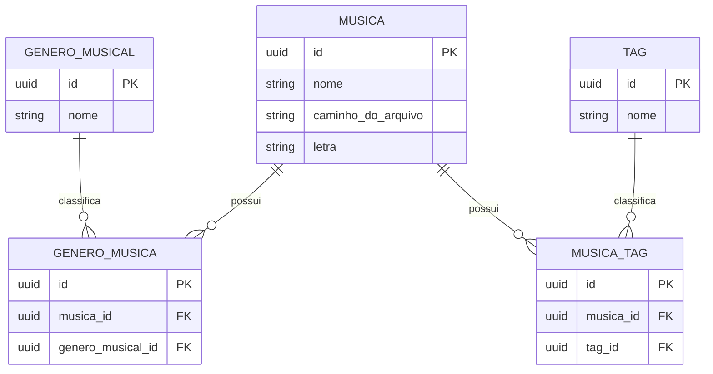

```mermaid
erDiagram
    GENERO_MUSICAL {
        uuid id PK
        string nome
    }

    TAG {
        uuid id PK
        string nome
    }

    MUSICA {
        uuid id PK
        string nome
        string caminho_do_arquivo
        string letra
    }

    GENERO_MUSICA {
        uuid id PK
        uuid musica_id FK
        uuid genero_musical_id FK
    }

    MUSICA_TAG {
        uuid id PK
        uuid musica_id FK
        uuid tag_id FK
    }

    MUSICA ||--o{ GENERO_MUSICA : possui
    GENERO_MUSICAL ||--o{ GENERO_MUSICA : classifica
    MUSICA ||--o{ MUSICA_TAG : possui
    TAG ||--o{ MUSICA_TAG : classifica
```
