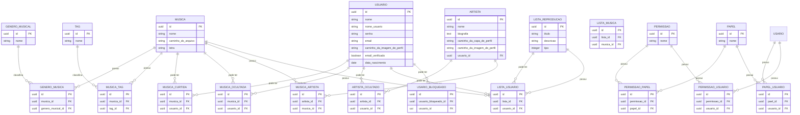

```mermaid
erDiagram
    GENERO_MUSICAL {
        uuid id PK
        string nome
    }

    TAG {
        uuid id PK
        string nome
    }

    MUSICA {
        uuid id PK
        string nome
        string caminho_do_arquivo
        string letra
    }

    GENERO_MUSICA {
        uuid id PK
        uuid musica_id FK
        uuid genero_musical_id FK
    }

    MUSICA_TAG {
        uuid id PK
        uuid musica_id FK
        uuid tag_id FK
    }

    USUARIO {
        uuid id PK
        string nome
        string nome_usuario
        string senha
        string email
        string caminho_da_imagem_de_perfil
        boolean email_verificado
        date data_nascimento
    }

    MUSICA_CURTIDA {
        uuid id PK
        uuid musica_id FK
        uuid usuario_id FK
    }

    MUSICA_OCULTADA {
        uuid id PK
        uuid musica_id FK
        uuid usuario_id FK
    }

    ARTISTA {
        uuid id PK
        string nome
        text biografia
        string caminho_da_capa_de_perfil
        string caminho_da_imagem_de_perfil
        uuid usuario_id FK
    }

    ARTISTA_OCULTADO {
        uuid id PK
        uuid artista_id FK
        uuid usuario_id FK
    }

    MUSICA_ARTISTA {
        uuid id PK
        uuid artista_id FK
        uuid musica_id FK
    }

    LISTA_REPRODUCAO {
        uuid id PK
        string titulo
        string descricao
        integer tipo
    }

    LISTA_USUARIO {
        uuid id PK
        uuid lista_id FK
        uuid usuario_id FK
    }

    LISTA_MUSICA {
        uuid id PK
        uuid lista_id FK
        uuid musica_id FK
    }

    USARIO_BLOQUEADO {
        uuid id PK
        uuid usuario_bloqueado_id FK
        uui usuario_id FK
    }

    PERMISSAO {
        uuid id PK
        string nome
    }

    PAPEL {
        uuid id PK
        string nome
    }

    PERMISSAO_USUARIO {
        uuid id PK
        uuid permissao_id FK
        uuid usuario_id FK
    }

    PAPEL_USUARIO {
        uuid id PK
        uuid pael_id FK
        uuid usuario_id FK
    }

    PERMISSAO_PAPEL {
        uuid id PK
        uuid permissao_id FK
        uuid papel_id FK
    }
    MUSICA ||--o{ GENERO_MUSICA : possui
    GENERO_MUSICAL ||--o{ GENERO_MUSICA : classifica
    MUSICA ||--o{ MUSICA_TAG : possui
    TAG ||--o{ MUSICA_TAG : classifica

    MUSICA ||--o{ MUSICA_CURTIDA : "pode ter"
    USUARIO ||--o{ MUSICA_CURTIDA : "pode ter"

    MUSICA ||--o{ MUSICA_OCULTADA : "pode ter"
    USUARIO ||--o{ MUSICA_OCULTADA : "pode ter"

    ARTISTA ||--o{ ARTISTA_OCULTADO : "pode ter"
    USUARIO ||--o{ ARTISTA_OCULTADO : "pode ter"

    ARTISTA ||--o{ MUSICA_ARTISTA : "possui"
    MUSICA ||--o{ MUSICA_ARTISTA : "possui"

    USUARIO ||--o{ LISTA_USUARIO : "pode ter"
    LISTA_REPRODUCAO ||--o{ LISTA_USUARIO : "pode ter"

    MUSICA ||--o{ LISTA_USUARIO : "possui"
    LISTA_REPRODUCAO ||--o{ LISTA_USUARIO : "possui"

    USUARIO ||--o{ USARIO_BLOQUEADO : "pode ter"

    PAPEL ||--o{ PERMISSAO_PAPEL : "possui"
    PERMISSAO ||--o{ PERMISSAO_PAPEL : "possui"

    PAPEL ||--o{ PAPEL_USUARIO : "possui"
    USARIO ||--o{ PAPEL_USUARIO : "possui"

    USARIO ||--o{ PERMISSAO_USUARIO : "possui"
    PERMISSAO ||--o{ PERMISSAO_USUARIO : "possui"
```
