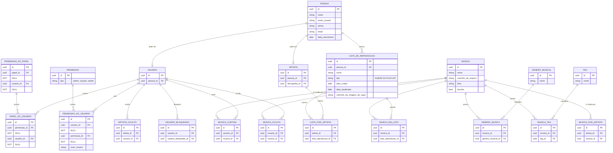

```mermaid
erDiagram
    PESSOA {
        uuid id PK
        string nome
        string nome_usuario
        string senha
        string email
        date data_nascimento
    }

    PERMISSAO {
        uuid id PK
        string tipo "admin, usuario, artista"
    }

    PERMISSAO_DO_PAPEL {
        uuid id PK
        uuid papel_id FK NOT NULL
        uuid usuario_id FK NOT NULL
    }

    PERMISSAO_DO_USUARIO {
        uuid id PK
        uuid usuario_id FK NOT NULL
        uuid permissao_id FK NOT NULL
        string ouvir_musica
    }

    PAPEL_DO_USUARIO {
        uuid id PK
        uuid permissao_id FK NOT NULL
        uuid usuario_id FK NOT NULL
    }

    ARTISTA_OCULTO {
        uuid id PK
        uuid artista_id FK
        uuid usuario_id FK
    }

    USUARIO {
        uuid id PK
        uuid pessoa_id FK
    }

    ARTISTA {
        uuid id PK
        uuid pessoa_id FK
        uuid discografia_id FK
    }

    LISTA_DE_REPRODUCAO {
        uuid id PK
        uuid pessoa_id FK
        string nome
        string tipo "ALBUM OU PLAYLIST"
        date data_criada
        date data_atualizada
        string caminho_da_imagem_de_capa
    }

    GENERO_MUSICAL {
        uuid id PK
        string nome
    }

    TAG {
        uuid id PK
        string nome
    }

    MUSICA {
        uuid id PK
        string nome
        string caminho_do_arquivo
        string letra
        bool favorita
    }

    GENERO_MUSICA {
        uuid id PK
        uuid musica_id FK
        uuid genero_musical_id FK
    }

    MUSICA_TAG {
        uuid id PK
        uuid musica_id FK
        uuid tag_id FK
    }

    MUSICA_EM_LISTA {
        uuid id PK
        uuid musica_id FK
        uuid lista_reproducao_id FK
    }

    USUARIO_BLOQUEADO {
        uuid id PK
        uuid usuario_id FK
        uuid usuario_bloqueado_id FK
    }

    MUSICA_CURTIDA {
        uuid id PK
        uuid usuario_id FK
        uuid musica_id FK
    }

    MUSICA_OCULTA {
        uuid id PK
        uuid usuario_id FK
        uuid musica_id FK
    }

    LISTA_POR_ARTISTA {
        uuid id PK
        uuid artista_id FK
        uuid lista_reproducao_id FK
    }

    MUSICA_POR_ARTISTA {
        uuid id PK
        uuid artista_id FK
        uuid musica_id FK
    }

    MUSICA ||--o{ GENERO_MUSICA : possui
    MUSICA ||--o{ MUSICA_TAG : possui
    MUSICA ||--o{ MUSICA_EM_LISTA : "está em"
    MUSICA ||--o{ MUSICA_CURTIDA : "é curtida por"
    MUSICA ||--o{ MUSICA_OCULTA : "é ocultada por"
    MUSICA ||--o{ MUSICA_POR_ARTISTA : "é criada por"

    GENERO_MUSICAL ||--o{ GENERO_MUSICA : classifica
    
    TAG ||--o{ MUSICA_TAG : classifica

    PESSOA ||--o| USUARIO : "pode ser"
    PESSOA ||--o| ARTISTA : "pode ser"
    PESSOA ||--o{ LISTA_DE_REPRODUCAO : possui
    
    LISTA_DE_REPRODUCAO ||--o{ MUSICA_EM_LISTA : possui
    LISTA_DE_REPRODUCAO ||--O{ LISTA_POR_ARTISTA : possui

    ARTISTA ||--o{ LISTA_POR_ARTISTA : possui

    PERMISSAO ||--o{ PERMISSAO_DO_USUARIO : possui
    PERMISSAO_DO_PAPEL ||--o{ PAPEL_DO_USUARIO : possui
    USUARIO ||--o{ PAPEL_DO_USUARIO : possui

    USUARIO ||--o{ PERMISSAO_DO_USUARIO : tem
    USUARIO ||--o{ ARTISTA_OCULTO : oculta
    USUARIO ||--o{ USUARIO_BLOQUEADO : bloqueia
    USUARIO ||--o{ MUSICA_CURTIDA : curte
    USUARIO ||--o{ MUSICA_OCULTA : oculta
```
